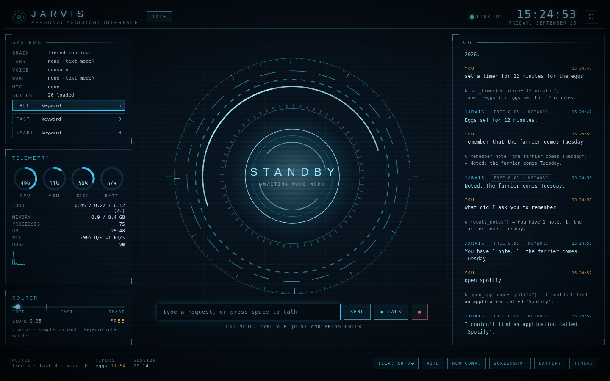

# Daxton AI

A classic Python voice assistant, rebuilt with today's open-source parts.

```
 "Daxton, ..."       speech                 text                  tools                 voice
 ────────────►  ──────────────►  ───────────────────►  ─────────────────►  ──────────────────►
 name spotting   faster-whisper    LLM with tool calling   skills (open apps,   ElevenLabs
 or openWakeWord (local, offline)  Anthropic / OpenAI /    web search, sites,   (or macOS `say`)
                                   Ollama / keyword mode   files, timers, ...)
```

Say **"Daxton, open Spotify"**, **"Daxton, what's the weather in Daly City"**, **"Daxton, set a timer for ten
minutes"** and it does it, out loud, in your ElevenLabs voice, with a live holographic dashboard (`daxton ui`) showing
what it hears, thinks and does. Everything runs on your Mac except the two paid APIs you
choose to plug in (the LLM and the voice), and both have free fallbacks.

## Lineage

This follows the classic open-source Python JARVIS template that hundreds of GitHub repos and tutorials share:
`speech_recognition` listens, a command router decides, `webbrowser` / `os` act, `pyttsx3` talks. The structure is the same
here (listen, recognize, route, act, speak) with each stage swapped for a modern, still free, open-source component:

| Stage | Classic template | This repo | License |
|---|---|---|---|
| Wake word | none (always listening) | name spotting in the transcript (fuzzy, so "Dexton" counts), or an [openWakeWord](https://github.com/dscripka/openWakeWord) model when one exists for the name (`hey_jarvis` ships pre-trained; a custom "hey Daxton" model can be trained) | Apache-2.0 code, CC BY-NC-SA 4.0 pre-trained models |
| Speech to text | Google Web Speech via `SpeechRecognition` | [faster-whisper](https://github.com/SYSTRAN/faster-whisper) locally (Google SR still available) | MIT |
| Brain | `if "open" in command:` keyword matching | Complexity-rated tiers: keyword rules or a local Ollama model for the simple stuff, Claude Haiku / Sonnet (or OpenAI) only when the request needs them | MIT SDKs |
| Skills | inline functions | `@skill` registry, one module per domain | this repo, MIT |
| Voice | `pyttsx3` | [ElevenLabs](https://elevenlabs.io) streamed PCM, macOS `say` as fallback | MIT SDK |
| Web search | `webbrowser.open("google.com/search?q=")` | [ddgs](https://github.com/deedy5/ddgs) results summarized by the brain, plus the classic "open it in the browser" | MIT |

## Requirements

- macOS on Apple Silicon (tested), Python 3.11 to 3.13 (3.12 recommended; the setup script uses `uv` to fetch it).
  Linux mostly works; Windows needs small changes in `daxton/skills/apps.py` and `system.py`.
- A microphone. The first run asks for Microphone permission for your terminal app.
- Optional keys, each with a free fallback:
  - `ELEVENLABS_API_KEY` for the voice (fallback: macOS `say`).
  - `ANTHROPIC_API_KEY`, `OPENAI_API_KEY`, or a running [Ollama](https://ollama.com) for the brain (fallback: keyword mode).

## Quick start (macOS)

```bash
git clone https://github.com/Tech-Cowboy/daxton-ai.git
cd daxton-ai
./scripts/setup_mac.sh        # venv, dependencies, model downloads, doctor
cp .env.example .env          # then put your keys in .env (the script does this if .env is missing)
source .venv/bin/activate
daxton doctor                 # every stage reports OK / WARN / FAIL with the fix
daxton                        # voice mode: say "Daxton, ..." in a sentence
```

Manual install, if you prefer:

```bash
uv venv --python 3.12 .venv && source .venv/bin/activate
uv pip install -e ".[all,dev]"       # or: pip install -e ".[all,dev]"
daxton download-models               # faster-whisper base.en (~150 MB), plus a wake model when one is configured
```

## The dashboard



```bash
daxton ui            # voice mode plus the live HUD at http://127.0.0.1:8765 (opens your browser)
daxton ui --app      # chromeless app window (Chrome, Brave or Edge), F11 or the corner button for full screen
daxton ui --no-voice # dashboard only: type requests, no microphone loop
```

The HUD is a local web page served by the assistant itself, so it mirrors the real thing: the core in the middle
changes with the assistant's state (standby, listening, decoding, processing, speaking) and pulses with the live
microphone and voice spectrum; the log shows every request, tool call and reply with its route badge (tier, score,
model); the Router panel shows the complexity score and the reasons behind the last routing decision; Systems shows
the three tiers with live highlighting and per-tier counts; Telemetry shows CPU, memory, disk, battery, load, network
and uptime from the machine. Controls: type a request and press Enter, `space` for push-to-talk, `Esc` to stop it
mid-sentence, mute, pin a tier, clear the conversation, and one-click skills (screenshot, battery, timers). The
`mic:` selector chooses whether Talk uses the Mac's microphone or the browser's own (see "The portal"), `Audio` plays
the voice in the browser, and `Mac speakers` decides whether the Mac plays it too. It is a single self-contained HTML
file with no external assets, so it works offline and in any modern browser, phones included.

The look is an original holographic command-center design in the classic movie-AI spirit: cyan and amber on dark,
concentric rings, ticks, scan lines. Fonts are the system's own, so nothing is fetched from the internet.

Under the hood: `daxton/events.py` is a thread-safe event bus the assistant publishes to (state, transcript, tool,
route, audio analysis at 12 Hz, telemetry at 1 Hz); `daxton/ui/server.py` is a FastAPI app with a WebSocket that
streams the bus to every open dashboard and accepts commands (`say`, `talk`, `stop_speaking`, `pin_tier`, `mute`,
`local_audio`, `new_conversation`, `run_skill`); `GET /api/state` returns a snapshot and `POST /api/command` runs a
command, so anything else (a Stream Deck button, a shortcut, another app) can drive the assistant too. The same socket
carries voice both ways for the portal: binary PCM frames in from a browser microphone, the spoken reply out.

## The portal: Daxton from anywhere

The dashboard can be published on the internet so you can talk to Daxton from your phone or any browser, with the
Mac at home doing the work. Full walkthrough in [`docs/portal.md`](docs/portal.md); the short version:

```bash
# 1. a login for the dashboard (12+ characters; without it, only the Mac itself is ever served)
echo 'DASHBOARD_PASSWORD=correct horse battery staple' >> .env

# 2. keep the assistant running (macOS launchd: at login, restarted if it stops)
daxton service install

# 3a. no domain needed: a Cloudflare quick tunnel, a random https://<words>.trycloudflare.com address
daxton tunnel quick --service        # prints the address; `daxton tunnel status` and the HUD's Portal row (with a
                                     # QR code for your phone) show the current one; it changes when the tunnel restarts

# 3b. your own domain (its DNS must be on Cloudflare): a named tunnel, a stable address, Cloudflare Access in front
echo 'PUBLIC_HOSTNAME=daxton.example.com' >> .env
daxton tunnel setup daxton.example.com
```

Then open the address on your phone: the login page asks for the dashboard password (and, with 3b, Cloudflare
Access asks who you are first), and the HUD appears. Press **Talk** and speak into the phone: the audio streams to the
Mac, Whisper transcribes it there, the brain answers, and the reply plays in the browser in the Daxton voice (and on
the Mac too, unless you switch `Mac speakers` off). Everything the Mac hears through its own microphone shows up on
the phone as well, so the portal is a window onto the same assistant, not a second one.

Security, in one paragraph: no port is opened on the Mac (cloudflared dials out); the dashboard's own password is
the lock, sessions are signed HttpOnly cookies that die when you change the password, failed logins are throttled,
cross-site requests and sockets are refused, and without `DASHBOARD_PASSWORD` the server refuses anything that did
not come from the Mac itself, whatever a tunnel forwards. With your own domain, Cloudflare Access adds a second lock
in front and keeps scanners away from the login page altogether. Browser microphones need HTTPS, which either tunnel
provides.

## Conversations: talk to Daxton like a person

`daxton convai setup` turns Daxton into a real conversational agent on your ElevenLabs account (the same
Conversational AI that powers phone agents): you talk, he answers within a second in the ElevenLabs voice, you can
cut in mid-sentence, and there is no wake word once a conversation is open. Claude is the brain (any model
ElevenLabs offers, `CONVAI_LLM`, default `claude-sonnet-5`). Every skill Daxton has is registered with the agent as a
*client tool*, so when he decides to open an app, search the web, read a file, run a command or hand a job to
Claude Code, the call comes back to the Mac (or to the dashboard page holding the conversation) and runs there;
nothing about the Mac is exposed to the internet for it.

```bash
echo 'ELEVENLABS_API_KEY=...' >> .env    # Profile > API keys on elevenlabs.io (never paste keys anywhere else)
daxton convai setup                      # creates or updates the agent and its tools from the current skills
daxton convai talk                       # a conversation on the Mac's mic and speakers, right now
```

After that, saying the name at the Mac (`daxton` or `daxton ui`) opens a conversation instead of a single exchange,
and it ends when you say goodbye or go quiet for `CONVAI_SILENCE_END` seconds (45). In the portal, the **Converse**
button does the same in the browser (phone included): the ElevenLabs SDK runs in the page and the tools run on the
Mac. Conversations are logged in the HUD and saved under `~/.daxton/conversations/`, and the last one is handed to
the next as context, along with your notes and any background tasks.

Without a headset a Mac hears its own speakers, so at the Mac the microphone is muted while Daxton talks
(`CONVAI_BARGE_IN=false`); in the browser, echo cancellation lets you interrupt freely.

### Real work

Beyond the original skills (apps, sites, search, timers, notes, screenshots), Daxton can now:

- **read_file, write_file, list_files** under your home folder (never `.env`, keys or keychains);
- **run_command** and **run_python**, with a deny list for the obviously destructive (`sudo`, `rm -rf /`, disk
  tools, piping the internet into a shell) and a 60 s limit; `DAXTON_SHELL=false` switches them off;
- **fetch_page** to read a web page properly, so "what does this article say" gets a real answer;
- **delegate_task**: "Daxton, build me a script that renames my photos by date" hands the brief to
  [Claude Code](https://claude.com/claude-code) running headless on the Mac in a task folder
  (`TASKS_DIR`, default `~/Documents/Claude/Projects/daxton-tasks/<date>-<slug>/`), keeps the conversation going,
  and tells you when it is done; **task_status** checks on it. Needs Claude Code installed and signed in.

## Free by default, smarter when it matters

Every request is scored for complexity before any model is called (a deterministic rater, microseconds, no API), and
the score picks a tier:

| Tier | Handles | Default model |
|---|---|---|
| **free** | commands, lookups, small talk ("open Safari", "what time is it", "set a timer") | a local Ollama model if one is running, otherwise the classic keyword rules (no model at all) |
| **fast** | free-form actions, factual questions, short summaries, jokes | Claude Haiku 4.5 (or the OpenAI fast model) |
| **smart** | reasoning, comparisons, writing, multi-step plans, long or subtle asks | Claude Sonnet 5 (or the OpenAI smart model) |

If the chosen tier fails (offline, rate limit, bad key) or cannot handle the request (the keyword rules do not match),
it escalates to the next tier automatically. Short follow-ups ("and the second one?") stay on the tier the previous
turn used. The tool-calling loop keeps one tier per turn. Every reply in `daxton chat` prints its route, and the
session ends with a count per tier.

```bash
daxton rate "compare the pros and cons of buying versus leasing a horse trailer"
#  score 0.90  ->  smart tier  (anthropic:claude-sonnet-5)
#  12 words; reasoning: compare, pros and cons, versus; long reasoning question
daxton --tier free chat     # pin a tier for this run (free | fast | smart), or --tier off for a single provider
```

Tune it in `.env`: `LLM_TIER_FREE`, `LLM_TIER_FAST`, `LLM_TIER_SMART` take `provider[:model]` (for example
`ollama:qwen3:4b`, `anthropic:claude-opus-5-5`, `openai:gpt-6-astra`, `keyword`); `ROUTING_FAST_THRESHOLD` and
`ROUTING_SMART_THRESHOLD` move the cut-offs (defaults 0.30 and 0.60); `ROUTING_ESCALATE=false` disables escalation.
Install Ollama (`brew install ollama && ollama pull qwen3:4b`) to make the free tier a real local model instead of
keyword rules; without it, anything the rules cannot parse goes straight to the fast tier.

## Commands

| Command | What it does |
|---|---|
| `daxton` / `daxton run` | Voice mode: wake word, listen, think, speak. Ctrl-C to stop. |
| `daxton chat` | Text mode: type requests, read replies. `--speak` also says them aloud. |
| `daxton ask "open safari"` | One request, one reply, exit. |
| `daxton say "Good evening, sir."` | Test the configured voice. |
| `daxton listen` | Record one utterance, print the transcript (tests the mic and Whisper). |
| `daxton ui` | Voice mode plus the live dashboard in your browser (`--app` for a chromeless window, `--no-voice` for text only). |
| `daxton convai setup` | Create or update the ElevenLabs conversation agent from the current skills; `talk` starts one at the Mac; `status`. |
| `daxton tunnel quick [--service]` | Publish the dashboard now at a random `https://<words>.trycloudflare.com` address (no domain, no account). |
| `daxton tunnel setup <host>` | Publish it at `https://<host>` on your own Cloudflare-hosted domain (`run` for a foreground test, `status` to check). |
| `daxton service install` | Keep `daxton ui` running at login (macOS launchd agent); `uninstall`, `status`. |
| `daxton rate "..."` | Show the complexity score, the reasons, and which tier and model would take the request. |
| `daxton doctor [--online]` | Check every stage; `--online` also calls the LLM and ElevenLabs APIs. |
| `daxton devices` | List microphones (set `MIC_DEVICE` in `.env`). |
| `daxton voices` | List the ElevenLabs voices on your account. |
| `daxton skills` | List the tools the brain can call. |
| `daxton download-models` | Pre-download the Whisper and wake word models. |

Global flags override `.env` for one run: `--tier`, `--llm`, `--tts`, `--stt`, `--wake`, `-v` (debug logging).
Examples: `daxton --wake push_to_talk` (press Enter to talk), `daxton --tier free chat` (never leave the free tier),
`daxton --llm keyword chat` (no API at all), `daxton --tts say` (skip ElevenLabs), `daxton --stt google` (no Whisper download).

## Waking Daxton

Out of the box, voice mode listens continuously and answers whenever it hears the name in a sentence: "Daxton, open
Safari", "what time is it, Daxton". The match is fuzzy, so the spellings speech-to-text tends to produce ("Dexton",
"Daxon", "Daxten") all count, and `ASSISTANT_ALIASES=Dax` adds a nickname. Nothing is sent anywhere until the name is
heard; the transcription runs locally.

For a true wake phrase ("hey Daxton", answered with "Yes, sir?" before you speak) you need a wake-word model, and the
free pre-trained ones only cover a few phrases (`hey_jarvis` among them). Train one with openWakeWord's
[automatic model training notebook](https://github.com/dscripka/openWakeWord/blob/main/notebooks/automatic_model_training.ipynb)
(it synthesises the phrase with text-to-speech, about an hour on a free Colab GPU), drop the `.onnx` file anywhere, and set
`WAKE_WORD=/path/to/hey_daxton.onnx`; `WAKE_MODE=auto` then switches to wake-word mode by itself. `WAKE_MODE=push_to_talk`
(Enter in the terminal, `space` on the dashboard) works with no model at all.

## What you can say

- **Apps**: "open Safari", "launch VS Code", "quit Spotify", "what apps are running", "is Figma installed"
- **Web**: "search for Buck Brannaman clinics near me", "what's the latest news about the Fed", "open YouTube",
  "play cowboy dressage on YouTube", "go to github.com", "who is Tom Dorrance" (Wikipedia)
- **Machine**: "what time is it", "set the volume to 30", "mute", "battery", "take a screenshot", "system stats",
  "open my Downloads folder", "find the file called budget 2026", "sleep the display"
- **Memory and timers**: "remember that the gate code is 4412", "what did I ask you to remember", "forget the gate code",
  "set a timer for 12 minutes for the eggs", "how long is left on the timer", "cancel the timers"
- **Session**: "new conversation", "goodbye" / "stop listening"

With an LLM brain the phrasing is free-form and it will chain tools ("find the horse-trailer listing you found earlier
and open it"). In keyword mode the phrases above are matched by pattern, like the original JARVIS-style scripts.

## Configuration (`.env`)

Copy `.env.example` to `.env`. Keys are read from the environment only; nothing here writes them anywhere.

| Variable | Default | Notes |
|---|---|---|
| `LLM_ROUTING` | `auto` | `auto` rates each request and picks a tier; `free` / `fast` / `smart` pins one; `off` uses the single `LLM_PROVIDER`. |
| `LLM_TIER_FREE`, `LLM_TIER_FAST`, `LLM_TIER_SMART` | `auto` | `provider[:model]` per tier. `auto` = Ollama or keyword / Haiku / Sonnet from the keys present. |
| `ROUTING_FAST_THRESHOLD`, `ROUTING_SMART_THRESHOLD` | `0.30`, `0.60` | Score cut-offs; `daxton rate` shows where a request lands. |
| `ROUTING_ESCALATE` | `true` | Move up a tier when the chosen one fails or cannot handle the request. |
| `LLM_PROVIDER` | `auto` | Pin one provider (turns tiers off): `anthropic`, `openai`, `ollama` or `keyword`. |
| `ANTHROPIC_API_KEY`, `ANTHROPIC_MODEL`, `ANTHROPIC_SMART_MODEL` | `claude-haiku-4-5-20251001`, `claude-sonnet-5` | Fast and smart tier models (`claude-opus-5-5` for the strongest). |
| `ANTHROPIC_WORKSPACE_ID` | empty | Only for an organization-level key: the `wrkspc_...` ID from Console > Settings > Workspaces. A key created inside a workspace needs nothing. |
| `OPENAI_API_KEY`, `OPENAI_MODEL`, `OPENAI_SMART_MODEL` | `gpt-6-luna`, `gpt-6-sol` | Any Chat Completions models with function calling (`gpt-6-astra` is the most capable). |
| `OLLAMA_MODEL`, `OLLAMA_SMART_MODEL`, `OLLAMA_HOST` | `qwen3:4b`, empty | Local free tier; optional bigger local model for the smart tier when no hosted key is set. |
| `TTS_PROVIDER` | `auto` | `elevenlabs` when a key is set, else `say` on macOS, else `console`. |
| `ELEVENLABS_API_KEY` | | Your ElevenLabs key. |
| `ELEVENLABS_VOICE_ID` / `ELEVENLABS_VOICE_NAME` | `onwK4e9ZLuTAKqWW03F9` (Daniel) | `daxton voices` lists yours; a name resolves to an ID at startup. |
| `ELEVENLABS_MODEL` | `eleven_flash_v2_5` | Lowest latency. `eleven_multilingual_v2` for the richest voice. |
| `ELEVENLABS_OUTPUT_FORMAT` | `pcm_24000` | Keep a `pcm_*` format; audio is streamed straight to the speaker, no ffmpeg. |
| `ELEVENLABS_STABILITY` / `_SIMILARITY` / `_STYLE` / `_SPEED` | `0.5 / 0.75 / 0.0 / 1.0` | Voice settings. |
| `TTS_CACHE` | `true` | Caches short phrases (the wake acknowledgement, confirmations) in `~/.daxton/tts-cache` to save credits. |
| `STT_PROVIDER` | `auto` | `whisper` if faster-whisper is installed, else `google`. |
| `WHISPER_MODEL` | `base.en` | `tiny.en` (fastest), `base.en`, `small.en` (more accurate), `medium.en`, `large-v3`. |
| `WAKE_MODE` | `auto` | `name` (always listening; say the name anywhere in the sentence, fuzzy-matched), `wakeword` (an openWakeWord model), `push_to_talk`. `auto` picks `wakeword` only when a model exists for the name. |
| `WAKE_WORD` | `auto` | A pre-trained openWakeWord name (`hey_jarvis`) or the path to a custom `.onnx` model you trained (see "Waking Daxton"). |
| `ASSISTANT_ALIASES` | empty | Other spellings speech-to-text produces for the name, comma-separated (`Dax, Dexton`). |
| `WAKE_THRESHOLD` | `0.5` | Raise toward 0.7 if it triggers on its own, lower toward 0.35 if it misses you. |
| `WAKE_ACK`, `WAKE_ACK_TEXT` | `phrase`, `Yes, sir?` | Or `chime` (a two-tone beep) or `none`. |
| `MIC_DEVICE` | system default | Index or name substring from `daxton devices`. |
| `MIN_SPEECH_RMS`, `SILENCE_SECONDS`, `MAX_UTTERANCE_SECONDS`, `LISTEN_TIMEOUT_SECONDS` | `0.010, 1.2, 15, 8` | Voice activity tuning. The mic calibrates to room noise at startup. |
| `ASSISTANT_NAME`, `PRODUCT_NAME`, `USER_NAME`, `HONORIFIC` | `Daxton`, `Daxton AI`, empty, `sir` | Persona and branding. |
| `HISTORY_TURNS`, `MAX_TOOL_ROUNDS`, `MAX_TOKENS` | `8, 6, 400` | Conversation memory, tool chaining depth, reply length. |
| `CONVAI_LLM`, `CONVAI_VOICE_ID`, `CONVAI_TTS_MODEL` | `claude-sonnet-5`, the ElevenLabs voice, `eleven_flash_v2` | The conversation agent's brain and voice. |
| `CONVAI_LOCAL`, `CONVAI_BARGE_IN`, `CONVAI_SILENCE_END`, `CONVAI_MAX_MINUTES` | `true`, `false`, `45`, `30` | Whether the name opens a conversation at the Mac, whether the Mac mic stays open while Daxton talks, and when a conversation ends by itself. |
| `DAXTON_SHELL`, `CLAUDE_CODE_BIN`, `TASKS_DIR`, `TASK_TIMEOUT_MINUTES` | `true`, on PATH, `~/Documents/Claude/Projects/daxton-tasks`, `30` | The work skills: shell on or off, where Claude Code is, where delegated tasks run. |
| `DASHBOARD_PASSWORD` | empty | Login for the dashboard. Empty: only the Mac's own browser is served. Set: every page, API call and socket needs the session cookie. Changing it signs everyone out. |
| `DASHBOARD_SECRET`, `DASHBOARD_SESSION_DAYS` | generated, `30` | Cookie signing secret (else one is generated into `~/.daxton/dashboard.secret`) and session length. |
| `DASHBOARD_HOST`, `DASHBOARD_PORT` | `127.0.0.1`, `8765` | Where `daxton ui` listens; the tunnel forwards to this port. |
| `PUBLIC_HOSTNAME`, `TUNNEL_NAME` | empty, `daxton` | The portal hostname (`daxton tunnel setup` default, WebSocket origin check) and the cloudflared tunnel name. |
| `DAXTON_DATA_DIR` | `~/.daxton` | Notes, the voice cache, the dashboard secret and service logs. |
| `LOG_LEVEL` | `WARNING` | `INFO` shows tool calls and timings; `-v` on the command line is `DEBUG`. |

`.env` is read from the current directory and from `~/.config/daxton/.env` (so `daxton` works from any folder).

## Adding a skill

A skill is a function. The docstring becomes the tool description, the annotations become the schema, and the return
string is what the assistant works from. Drop a module in `daxton/skills/`, add it to `DEFAULT_SKILL_MODULES` in
`daxton/skills/__init__.py`, and both the LLM brain and `daxton skills` pick it up.

```python
# daxton/skills/lights.py
from typing import Annotated
from daxton.skills.registry import skill

@skill()
def set_barn_lights(state: Annotated[str, "'on' or 'off'"], zone: Annotated[str, "Which lights, e.g. 'arena'"] = "all") -> str:
    """Turn the barn lights on or off."""
    ...  # call your hub here
    return f"Barn lights {state} in the {zone}."
```

Add `ctx: SkillContext = None` as a parameter to reach settings, `ctx.speak(text)` and `ctx.stop_event`. Keyword mode
only knows the built-in patterns; new skills are reachable through an LLM brain (or add a rule in
`daxton/brain/keyword_brain.py`).

## How it is put together

```
daxton/
  cli.py            commands (run, chat, ask, say, listen, ui, convai, tunnel, service, rate, doctor, devices, ...)
  events.py         thread-safe event bus (the dashboard's feed)
  config.py         Settings from .env / environment; provider auto-selection
  assistant.py      the loop: wake -> record -> transcribe -> router -> speak
  doctor.py         setup checks
  audio/            mic.py (sounddevice capture + energy VAD), player.py (streamed PCM playback), chime.py,
                    analysis.py (level + 16-band spectrum for the HUD)
  wake/             oww.py (openWakeWord), simple.py (push-to-talk, always-listening)
  stt/              whisper_local.py (faster-whisper), google_sr.py (SpeechRecognition)
  tts/              elevenlabs_tts.py (streaming + phrase cache), macos_say.py (rendered to PCM when tapped), console.py
  tunnel.py         the portal: cloudflared setup and the launchd service for `daxton ui`
  brain/            base.py (neutral Message/ToolSpec types), router.py (tool loop), prompts.py,
                    rating.py (complexity score -> tier), tiered.py (free -> fast -> smart with escalation),
                    anthropic_llm.py, openai_llm.py, ollama_llm.py, keyword_brain.py, factory.py
  skills/           registry.py (@skill), apps.py, web.py, system.py, files.py, notes.py, timers.py, control.py,
                    work.py (files, shell, Python, pages, delegate_task to Claude Code)
  convai/           the ElevenLabs Conversational AI agent: the agent as data, the sync, the Mac-side session
  ui/               server.py (FastAPI + WebSocket + telemetry), auth.py (login, sessions), voice.py (browser
                    microphone in, voice out), static/index.html (the HUD), static/login.html
tests/              200+ tests, no network, no audio hardware needed:  pytest
scripts/            setup_mac.sh
```

The brain is provider-neutral: the router keeps one history in its own `Message` type and each adapter converts to the
vendor's wire format, so adding a provider is one file. Every skill is exposed to all three LLMs from the same JSON
schema.

## Troubleshooting

- **"No usable input device" or it never hears you**: System Settings > Privacy & Security > Microphone, allow your
  terminal (Terminal, iTerm, VS Code). Then `daxton devices` and `daxton listen`.
- **It never answers to its name**: `daxton listen` shows what speech-to-text actually heard; add that spelling to
  `ASSISTANT_ALIASES`. With a wake-word model, `daxton -v` prints scores; try `WAKE_THRESHOLD=0.35`, or `--wake push_to_talk`
  to rule out the mic. If a wake model triggers by itself, raise the threshold.
- **It transcribes its own voice**: the mic is flushed after each reply; if your speakers are loud, use headphones or
  `WAKE_ACK=chime`.
- **Slow first response**: the Whisper model loads once at startup (a few seconds); the first ElevenLabs reply takes a
  network round trip, cached phrases are instant. `tiny.en` is faster than `base.en`.
- **ElevenLabs errors**: `daxton doctor --online` verifies the key and lists voices. Free-tier accounts have a monthly
  character quota; `TTS_CACHE` keeps repeated phrases free.
- **No LLM key**: everything still works in keyword mode (`daxton --llm keyword`), which is the classic experience.
- **The portal shows "Local only"**: `DASHBOARD_PASSWORD` is not set in the `.env` the running `daxton ui` loaded;
  set it and restart. **The service says the microphone has not opened**: the first run as a background service
  makes macOS ask whether Python may use the microphone; click Allow (System Settings > Privacy & Security >
  Microphone). The dashboard and the portal keep working in text and browser-voice mode while it waits. **Talk does nothing on the phone**: the page needs HTTPS for the microphone (the tunnel gives
  it; plain `http://<lan-ip>` does not) and the first tap must be yours (browsers block audio until you interact).
  **No sound on the phone**: tap the "enable audio" prompt or the `Audio` button once. `daxton tunnel status` and
  `daxton doctor` show what is missing.
- **Python 3.14**: some audio wheels lag new Python releases; the setup script pins 3.12 through `uv`.
- **`ModuleNotFoundError: No module named 'daxton'` when running `daxton` from another folder**: Python 3.12+ skips
  `.pth` files that carry the macOS hidden flag, so the editable install goes invisible. `uv` sets the flag on
  `.venv`, and a folder linked to the Claude desktop app gets every dot-folder re-flagged within seconds, so
  `chflags -R nohidden .venv` only helps briefly. The setup script installs a `sitecustomize.py` in the venv that
  falls back to the repo checkout whenever the `.pth` was skipped; rerun `./scripts/setup_mac.sh` if you rebuilt
  the venv by hand.

## Costs and privacy

Wake word detection, speech-to-text and the skills run on your machine. Only the text of what you said (plus tool
results) goes to the LLM provider you chose, and only the reply text goes to ElevenLabs. Ollama plus `say` is fully
offline. Notes live in `~/.daxton/notes.json`.

## License

MIT for this repository (see `LICENSE`). openWakeWord's pre-trained models (such as `hey_jarvis`) are CC BY-NC-SA 4.0
(non-commercial); a model you train yourself with openWakeWord carries no such restriction.
